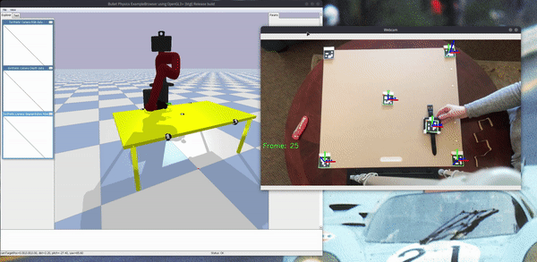

## Teleoperation of Sawyer with Cairo Sim and Aruco Tags via Camera

Building a way to teleoperate a robot via two cameras to more intuively operate a robot. 

## Dependencies:

The setup.sh file will clone the cairo simulator.
 
1. `chmod +x setup.sh`
2. `./setup.sh`

### TODO 
- [ ] Orientation of watch - Possibly switch to Aruco Cube?
- [x] Z-coordinate

### How can it improve
- Adding generality, right now there are some hard constants that need to be met for the project to work, camera with a birds eye view which is ideally normal to the workspace.
- Add real time capabilites, currently with no external webcam I am unable to stream video to my laptop, and IPhone apps cost money. 
- Using a single Intel RealSense Depth Camera to accurately capture depth data. Only issue with this is finding the orientation of the end effector accurately.
- Using a LeapMotion VR camera, and just caring about hand poses, super accurate camera but only within a small distance, would only be practical in applications where the workspace is very small and allows for a close camera.
- Better GPU, Openpose, and FLIR or multiple RGB cameras. With A better GPU I could access the features that require more memory, and with mutiple cameras or a FLIR camera, a 3D pose could be extracted and used. 
- Generalize camera location. As it stands, the camera's need to have a specific location and orientation, and better generalizing this to different angles and orientations would make the system more robust. 

### Trials and Tribulations 

- **Open Pose**
Initially I wanted to build this using openpose, but since I only have a GTX 1050Ti w/ 4GB memory, I missed out on a lot of the features of openpose that
requires more. Things like face and hand poses require more than what was available, so that had to be scrapped and I used Aruco Tags instead. This could be a great addition given I had the correct hardware, this way I could control a full humanoid robot, or something similar.

