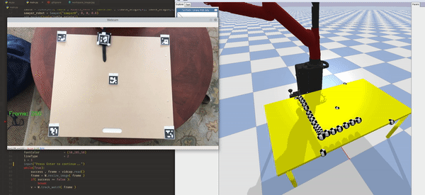

## Teleoperation of Sawyer with Cairo Sim and Aruco Tags via Camera

Building a way to teleoperate a robot via two cameras to more intuively operate a robot. 

Current Status, using just markers. No inverse kinematics yet.

